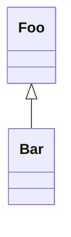

# template-deno-library

[](https://github.com/flowscripter/template-deno-library/releases)
[](https://github.com/flowscripter/template-deno-library/actions/workflows/release-deno-library.yml)
[](https://codecov.io/gh/flowscripter/template-deno-library)
[](https://jsr.io/@flowscripter/template-deno-library/doc)
[](https://github.com/flowscripter/template-deno-library/blob/main/LICENSE)

> Project template for a Deno library.

## Project Template Usage

1. Use as a
   [template](https://docs.github.com/en/github/creating-cloning-and-archiving-repositories/creating-a-repository-from-a-template)
   to create a new repository.
2. Update links and references in `README.md`.

## Deno Module Usage

Install from https://jsr.io/@flowscripter/template-deno-library

```typescript
import { world } from "@flowscripter/template-deno-library";

world();
```

## Development

Test: `deno test -A --unstable`

Lint: `deno fmt`

## Documentation

### Overview



### API

Link to auto-generated API docs for the library:

[API Documentation](https://jsr.io/@flowscripter/template-deno-library/doc)

## License

MIT © Flowscripter
